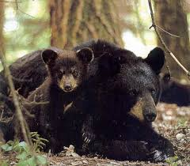
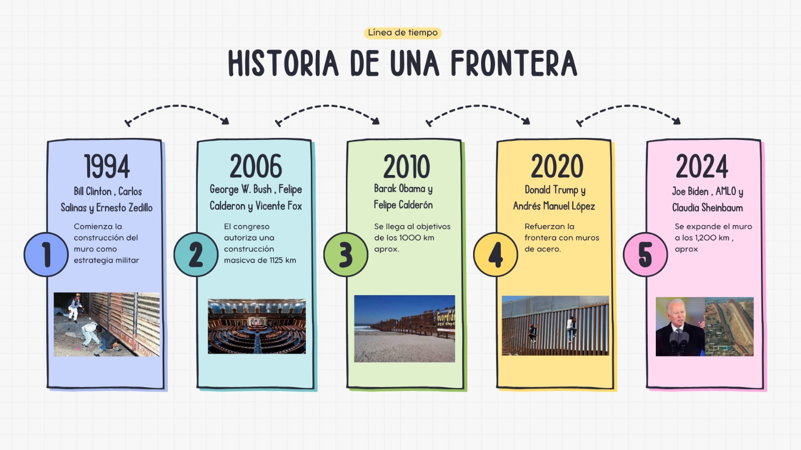

# Afectaciones de la Barrera Fronteriza entre Mexico y U.S.A en la Poblacion del Osos negro americano

#### Universidad Nacional Autonoma de Mexico

#### Facultad de Estudios Superiores Iztacala

#### Materia: Informatica Ecologica

#### **Integrantes:**

-   Lemus Tello Alexa Glenn

-   Olvera Zarate Diego Alexis

-   Trejo Zarco Gissela

#### Fecha:

27 de octubre del 2025

#### ------------------------------------------------------------------------------

## Introducción 

-   **Tema de la investigacion:**

Como la barrera fronteriza entre Estados Unidos y Mexico fue puesta sin
pensar en el paso de la fauna silvestre local, causando que la población
del Oso negro americano quedará fragmentada y con menos oportunidad de
obtener alimento, agua y un refugio.

-   **Pregunta a resolver:**

¿Cuál es el impacto poblacional visto en la especie *Ursus americanus*
después de colocarse el muro fronterizo entre Mexico y Estados Unidos?

El presente análisis busca observar cómo ha cambiado la distribución del
oso negro americano (*Ursus americanus*) desde la década de los setenta
hasta la de los años dos mil veinte, con el propósito de determinar si
las modificaciones en su rango de distribución se relacionan con la
construcción y fortalecimiento del muro fronterizo entre México y
Estados Unidos.

A lo largo de las últimas décadas, la expansión urbana, el cambio de uso
de suelo y las políticas fronterizas han transformado significativamente
los ecosistemas compartidos por ambos países. Estas alteraciones han
reducido los corredores biológicos que permiten la migración y el flujo
genético de diversas especies, entre ellas el oso negro americano. Por
ello, analizar la variación en su distribución geográfica a lo largo del
tiempo no solo permite comprender el impacto del muro fronterizo, sino
también evaluar las consecuencias ecológicas y evolutivas que la
fragmentación del hábitat puede generar en sus poblaciones

## Objetivos

-   Observar cómo ha cambiado la distribución de Ursus americanus en el
    tiempo y si las barreras humanas, como el muro fronterizo, podrían
    estar afectando sus rutas de dispersión

## **Justificación**

El oso negro americano (*Ursus americanus*) ha habitado la zona
fronteriza entre México y Estados Unidos desde hace aproximadamente tres
millones de años. No obstante, durante los siglos XIX y XX su población
disminuyó de forma considerable debido a la caza indiscriminada, y hasta
la actualidad no ha logrado una recuperación completa. Esta reducción
poblacional provocó la pérdida significativa de diversidad genética
dentro de la especie.

La conservación del oso negro americano resulta de gran relevancia
ecológica, ya que cumple funciones esenciales en el mantenimiento de los
ecosistemas, como la dispersión de semillas y la regulación de cadenas
tróficas. Además, su presencia refleja el equilibrio ambiental de las
zonas montañosas y boscosas que habita. Por ello, comprender y atender
los factores que amenazan su supervivencia es fundamental para
garantizar la conservación de la biodiversidad en las regiones
fronterizas.

## **Planteamiento del problema**

En la actualidad, el *Ursus americanus* enfrenta un nuevo desafío: la
fragmentación de su hábitat. Este proceso está reduciendo
progresivamente sus rutas de migración naturales, como la ruta
Arizona-México, la cual cuenta actualmente con una extensión de
aproximadamente 580 kilómetros, y se encuentra interrumpida por una
barrera fronteriza de 10 centímetros de ancho y 9 metros de altura.

Las políticas recientes del gobierno de los Estados Unidos, enfocadas en
el fortalecimiento del muro fronterizo, han intensificado esta
fragmentación ecológica. Dicha infraestructura no solo profundiza la
separación política y económica entre ambos países, sino también la
ecológica, al limitar el movimiento y la conectividad genética de
múltiples especies silvestres. De acuerdo con estudios de **Sky Island
Alliance** y **Wildlands Network** (Miranda, 2025), el 86% de los cruces
de vida silvestre en la región se han visto afectados. Esta situación
amenaza la variación genética de las poblaciones de osos negros en ambos
países, lo que, a largo plazo, podría conducir a un proceso de extinción
local por pérdida de diversidad genética (Torres, 2022).

## *Ursus Americanus*

{width="493"}

### 1. Ficha tecnica

+:----------------------------:+:-----------------------------------:+
| #### Nombre cientifico       | *Ursus Americanus*                  |
+------------------------------+-------------------------------------+
| #### Nombre comun:           | Oso negro americano                 |
+------------------------------+-------------------------------------+
| #### **Filo**                | Chordata                            |
+------------------------------+-------------------------------------+
| #### **Clase**               | Mammalia                            |
+------------------------------+-------------------------------------+
| #### **Orden**               | Carnivora                           |
+------------------------------+-------------------------------------+
| #### **Familia**             | Ursidae                             |
+------------------------------+-------------------------------------+
| #### **Género**              | *Ursus*                             |
+------------------------------+-------------------------------------+
| #### **Especie**             | *Americanus*                        |
+------------------------------+-------------------------------------+
| #### **Nombre común**        | Oso negro americano                 |
+------------------------------+-------------------------------------+
| #### **Tamaño promedio**     | -   **Macho :** 1.4 a 2 metros      |
|                              |                                     |
|                              | -   **Hembra:** 1.2 a 1.6 metros    |
+------------------------------+-------------------------------------+
| #### **Esperanza de vida**   | Mas de 20 años                      |
+------------------------------+-------------------------------------+

: Ficha tecnica del *Ursus americanus*

### **1.2. Comportamiento que tiene esta especie:**

Son animales solitarios con hábitos diurnos y crepusculares , sin
embargo esta conducta está sujeta a la estacionalidad . En temporada de
cría se pueden ver grupos de hembras donde habrá un macho dominate
siendo que por ello habrá una marcada jerarquía social que será
determinada por el sexo, el tamaño corporal, la fuerza y la agresividad
de cada individuo. 

{width="365"}

### **1.3 Importancia ecológica** 

-   Dispersión de semillas. 

-   Control de insectos 

-   Control de la población de algunos mamíferos pequeños y grandes. 

### **1.4 Estado de conservación**

En México es considerada una especie en peligro de extinción “P” de
acuerdo a la Norma Oficial Mexicana 059 desde 2002 (De Áreas Naturales
Protegidas, n.d.) , en Estados Unidos tiene un estado de  preocupación
menor “LC” , al igual que a nivel global de acuerdo a la información de
Red list del 2016. 

### **1.5 Localización potencial**

El Ursus Americanus es un oso que históricamente se ha distribuido  en
América del norte  habitando lugares templados , semiáridos y templados 
en los territorios de Alaska , Canadá , 32 entidades de Estados Unidos y
diversos estos el norte de México.


## Antecedentes

A lo largo de la historia las barreras geográfica ha llevado a procesos
de especiación y extinción , pero en la actualidad estas barreras están
siendo formadas por los humanos como fue el caso de Eslovenia que en
2015 levantó una frontera en los Montes Dináricos para así cerrar las
ruta de los migrantes humano pero también dividido la poblaciones de
lobos euroasiáticos, osos pardos y linces (Bernardic, 2016)  siendo que
este caso es revivido con mayor intensidad en la actualidad con la
situación de los animales de los animales de la frontera de México y
Estados Unidos, levantada ´por el presidente Trump en 2017 . 

{width="486"}

## **Librerias necesarias:**

```{r}
install.packages("rnaturalearthhires",
                 repos = c("https://ropensci.r-universe.dev", "https://cloud.r-project.org"))

```

```{r}
library(raster) #Maneja y analiza datos espaciales en formato de cuadrículas.
library(maps) #Dibuja mapas básicos
library(mapdata) #Proporciona mapas más detallados.
library(sp) #Trabaja con datos espaciales y vectoriales.
library(reshape2) #Reorganiza y transforma datos de formato ancho y largo.
library(mgcv) #Ajusta modelos generalizados para modelar datos complejos.
library(rgbif) #Proporciona acceso a la API del (GBIF), datos de biodiversidad
library(ggplot2) #Visualización de datos, permite generar gráficos
library(sf) #Para manejar y procesar datos geoespaciales y realizar análisis espaciales o crear mapas.
library(dplyr)# Para manipulación de datos tabulares.
library(tidyverse)#Manipulación, análisis y visualización de datos.
library(terra)#Leer, manipular y analizar grandes conjuntos de datos espaciales en formato ráster.
library(readr)#Importar datos en diferentes formatos de texto como CSV, TSV, y archivos delimitados.
library(readxl)#Paquete para leer archivos de Excel en R. 
library(ggspatial)#Agregar elementos específicos de los mapas como escalas, flechas del norte, anotaciones espaciales.
library(rnaturalearth)#para cargar archivos shp de mexico
library(rnaturalearthdata)#escalas mayores
library(viridis) #para paletas de colores.
library(patchwork)#Combinar graficos en R
library(grid)# Para utilizar el objeto grob
library(gridExtra)# Paquete necesario para combinar gráficos
library(paletteer) #para paletas de colores.
library(devtools) #Simplifica y agiliza el desarrollo de paquetes R.
library(readr) #Poder leer datos rectangulares de archivos delimitados, como valores separados por comas (CSV)
library(elevatr) #Acceso a los datos de elevación desde las API web.
library(rnaturalearthhires)#para hacer mapas de alta resolución (escala 10)
library(ggtext)

```

## La historia del mundo fronterizo entre Estados Unidos y Mexico

El **muro fronterizo** entre los Estados Unidos y México ha sido una
infraestructura clave en las políticas de seguridad y control migratorio
desde la década de 1990. Su construcción comenzó bajo la administración
de Bill Clinton con el **Programa de Seguridad Fronteriza**, que
consistía en cercas en áreas urbanas para controlar los cruces ilegales.
Posteriormente, durante la administración de George W. Bush en 2006, la
Ley de Seguridad Fronteriza expandió su construcción hacia áreas
rurales. La administración de Donald Trump (2017-2021) impulsó la
construcción de un muro completo, mientras que la administración de Joe
Biden en 2021 pausó la expansión, aunque algunas secciones aún están en
construcción.

{width="436"}

## Linea del tiempo de la frontera



## Impacto del Muro Fronterizo sobre la Fauna: **Ursus americanus**

El **muro fronterizo** ha tenido un impacto ambiental significativo,
especialmente en especies como **Ursus americanus** (oso negro
americano). Las barreras físicas han fragmentado sus hábitats, limitando
su capacidad para moverse entre México y los Estados Unidos. Esto ha
alterado sus patrones migratorios, su acceso a fuentes de alimento y ha
aislado poblaciones, afectando la diversidad genética y poniendo en
riesgo su conservación a largo plazo.

Este proyecto analiza cómo la construcción del muro ha afectado la
abundancia y distribución de **Ursus americanus** en las regiones
fronterizas, evaluando las consecuencias de la fragmentación de su
hábitat.

{width="541"}

{width="544"}

## 2. Limpieza de la base de datos

#### **2.1 Parametros de busqueda:**

```{r}
especie <- "Ursus americanus" #Creamos un valor llamado especie, a partir de nuestra especie.
pais1 <- "MX" #Creamos un valor llamado pais1, a partir de México (se pone con su código ISO).
pais2 <- "US" #Creamos un valor llamado pais2, a partir de Estados Unidos (se pone con su código ISO)
year_range <- c(1970, 2024) #Creamos un vector, en donde solo nos muestre 
```

#### **2.2 Obtener taxonKey**

```{r}
taxon <- name_backbone(name = especie, rank = "species")
taxon_key <- taxon$usageKey
```

#### 2.3 Descarga de ocurrencias desde GIBFT

```{r}
res_mx <- occ_search(
  taxonKey = taxon_key,
  country = pais1,
  hasCoordinate = TRUE,
  basisOfRecord = "HUMAN_OBSERVATION",
  year = paste0(year_range[1], ",", year_range[2]),  
  limit = 20000
)

```

```{r}
res_us <- occ_search(
  taxonKey = taxon_key,
  country = pais2,
  hasCoordinate = TRUE,
  basisOfRecord = "HUMAN_OBSERVATION",
  year = paste0(year_range[1], ",", year_range[2]),
  limit = 20000
)
```

#### 2.4 Union de data frames

```{r}
df_mx <- res_mx$data
df_us <- res_us$data

datos_ursus <- bind_rows(df_mx, df_us) %>%
  select(key, species, genus, decimalLongitude, decimalLatitude,
         year, stateProvince, country, countryCode)
```

#### 2.5 Limpieza y filtrado de datos

```{r}
datos_ursus <- datos_ursus %>%
  filter(!is.na(decimalLongitude),
         !is.na(decimalLatitude),
         !is.na(year)) %>%
  distinct(key, .keep_all = TRUE) %>%
  mutate(
    year = as.integer(year),
    countryCode = toupper(countryCode)
  ) %>%
  filter(
    year >= year_range[1],
    year <= year_range[2],
    countryCode %in% c("MX", "US")
  )
```

## 3. Acomodo de los datos

#### 3.1 Agrupar por décadas

```{r}
datos_ursus <- datos_ursus %>% mutate(decada = paste0(floor(year / 10) * 10, "s"))

decadas_tabla <- datos_ursus %>% group_by(country = countryCode, decada) %>% summarise(abundancia = n(), .groups = "drop")
```

#### 3.2 Completar décadas faltantes

```{r}
# ---- 6. Completar décadas faltantes ----
decadas_niveles <- c("1970s", "1980s", "1990s", "2000s", "2010s", "2020s")
decadas_tabla <- decadas_tabla %>%
  complete(country = c("MX", "US"),
           decada = decadas_niveles,
           fill = list(abundancia = 0)) %>%
  mutate(decada = factor(decada, levels = decadas_niveles))

```

#### 3.3 Resultado final

```{r}
print(decadas_tabla)

datos_recientes <- datos_ursus %>%
  filter(decada %in% c("2010s", "2020s"))

#Por falta de datos del 2010 para atrás en ambos países, el proyecto se redujo de intervalos de tiempo a las decádas de los 2010´s y 2020´s.Le pedimos al paquete que solo nos de los datos de los 2010´s y los 2020´s.
```

## 4. Analisis y graficos

#### 4.1 Gráfico de Barras para ver la Abundancia del Ursus americanus a través de los años (México vs EEUU

```{r}
 ls()           
abund_anual <- datos_recientes %>%
  group_by(year, countryCode) %>%
  summarise(abundancia = n(), .groups = "drop")

Grafico_Abundancia <- ggplot(abund_anual, aes(x = factor(year), y = abundancia, fill = countryCode)) +
  geom_bar(stat = "identity", position = position_dodge(width = 0.8), color = "gray20") +
  scale_fill_manual(values = c("MX" = "#D55E00", "US" = "#0072B2"),
                    labels = c("México", "Estados Unidos")) +
  theme_minimal(base_size = 13) +
  labs(
    title = "Abundancia anual de *Ursus americanus* (2010–2024)",
    subtitle = "Comparación entre México y Estados Unidos",
    x = "Año",
    y = "Número de observaciones (abundancia)",
    fill = "País"
  ) +
  theme(
    plot.title = element_text(face = "bold", size = 15, hjust = 0.5),
    plot.subtitle = element_text(size = 12, hjust = 0.5),
    axis.text.x = element_text(angle = 45, vjust = 0.9, hjust = 1),
    legend.position = "top",
    panel.grid.minor = element_blank(),
    panel.grid.major.x = element_blank()
  )

Grafico_Abundancia

```

México  hay una menor abundancia  que en EEUU esto  también  lo podemos
ver reflejado en sus estados de conservación,  además que , actualmente 
el Ursus Anericanus en 2024 llego  en su punto mas alto de abundancia de
este siglo siendo que esto puede ser debido a las ONG’s de EEUU que han
trabajado de forma activa para aumentar la población de este organismo 
, por ejemplo “Defenders of wildlife”  quienes con ayuda de otras ONG’s
lograron sacar al oso americano de la lista de las especies amenazadas
en 2012 siendo que desde ahí  va creciendo de poco en poco hasta en 2018
tener un gran incremento  siendo que es el momento clave en el que
décadas de gestión para la preservación de las especie dieron sus frutos
, además de que también esto provocó el aumento de osos y humanos. 

#### 4.2 Gráfico de dispersión sobre la latitud a la que están los individuos de Ursus Americanus (México vs EEUU)Gráfico de dispersión sobre la latitud a la que están los individuos de Ursus Americanus (México vs EEUU)

-   **Calcular distancia al muro (aprox con el paralelo 31°N**)

```{r}

# Diferencia en latitud respecto a la frontera
# Cada grado de latitud ≈ 111 km
datos_recientes <- datos_recientes %>%
  mutate(
    dist_muro_km = (decimalLatitude - 31) * 111,
    # Norte (EE.UU.) será positivo, Sur (México) negativo
    dist_muro_km = ifelse(countryCode == "MX", -abs(dist_muro_km), abs(dist_muro_km))
  )
```

-   **Agrupacion por década, país y redondeo distancias**

```{r}
datos_dist <- datos_recientes %>%
  mutate(dist_km_redondeada = round(dist_muro_km, -1)) %>%  # redondea cada 10 km
  group_by(decada, countryCode, dist_km_redondeada) %>%
  summarise(observaciones = n(), .groups = "drop")
```

#### 4.3 Gráfico de dispersión bilateral

```{r}
Grafico_dispersion <- ggplot(datos_dist, aes(x = dist_km_redondeada, y = observaciones, color = countryCode)) +
  geom_point(size = 3, alpha = 0.8) +
  geom_vline(xintercept = 0, color = "black", linetype = "dashed") +
  scale_color_manual(values = c("MX" = "#D55E00", "US" = "#0072B2")) +
  facet_wrap(~decada, ncol = 1) +
  theme_minimal(base_size = 13) +
  labs(
    title = "Distribución del *Ursus americanus* respecto al muro fronterizo",
    subtitle = "Distancia aproximada (km) desde la frontera México–EE.UU.\nComparación entre décadas 2010s y 2020s",
    x = "Distancia al muro (km; 0 = frontera)",
    y = "Número de observaciones",
    color = "País"
  ) +
  theme(
    plot.title = element_text(face = "bold", hjust = 0.5),
    plot.subtitle = element_text(hjust = 0.5),
    strip.text = element_text(face = "bold", size = 12),
    panel.grid = element_line(color = "gray85")
  )

Grafico_dispersion
```

Este gráfico es interesante ya que nos muestra como una parte de los
osos de EEUU  se niegan a moverse de su nicho , pero que conforme se
aleja la distancia aunque son menos los individuos que exploran más
hacia la parte de Alaska para asía.

## 5. Graficos de exploracion de los datos

#### 5.1 Gráfico de mapas comparativos en donde nos muestran la frecuencia de observaciones entre ambos países

```{r}
mx <- ne_states(country = "Mexico", returnclass = "sf")
us <- ne_states(country = "United States of America", returnclass = "sf")
mapa_base <- rbind(mx, us) #Unimos ambos


Grafico_mapas <- ggplot() +
  geom_sf(data = mapa_base, aes(fill = admin), color = "gray40", size = 0.3, show.legend = FALSE) +
  geom_point(
    data = datos_recientes,
    aes(x = decimalLongitude, y = decimalLatitude, color = countryCode),
    size = 1.6, alpha = 0.7
  ) +
  scale_color_manual(values = c("MX" = "#E69F00", "US" = "#0072B2")) +
  coord_sf(xlim = c(-125, -90), ylim = c(15, 55), expand = FALSE) +
  facet_wrap(~decada, ncol = 2) +
  theme_minimal(base_size = 12) +
  labs(
    title = "Distribución reciente del *Ursus americanus* (2010–2024)",
    subtitle = "Comparación entre México y Estados Unidos por década",
    color = "País",
    x = "Longitud",
    y = "Latitud"
  ) +
  theme(
    strip.text = element_text(face = "bold", size = 11),
    plot.title = element_text(face = "bold", size = 14, hjust = 0.5),
    plot.subtitle = element_text(size = 12, hjust = 0.5),
    panel.grid = element_line(color = "gray85", size = 0.2)
  )

Grafico_mapas
```

En esta gráfica podemos ver de manera localizada los puntos donde se
avistaron los osos negros en ambos paies entre las decadas de 2010 y
2020 siendo  que en los mapas podemos ver una relación opus entere ellos
ya que México en 2010 tenía más osos que en la actualidad mientras que
EEUU tenia menos osos y ahora estos aumentron siendo que est nos lleva a
pensar que es probable que en el caso de México las acciones tomadas por
Semarnat no son delv todo eficaces , mientras que las tomadas  por EEUU 
son más efectivas , para lo cual me gustaria destacar el caso de
California que si bien no era un estado con pocos individuos despues de
que se prohibire la caza de estos organismos vemos como a la siguiente
decada presenta grandes resultados , por su parte en México haun un
deceso en la abundancia  de la especie siendo que esto lleva a
preguntarnos si es que los programas de SEMARNAT funcionan  de verdad .

#### **5.2 Gráfico de boxplots**

```{r}
Grafico_Boxplots <- ggplot(datos_recientes, aes(x = factor(year), y = decimalLatitude, fill = countryCode)) +
  geom_boxplot(outlier.shape = 21, outlier.alpha = 0.6, outlier.size = 2, color = "gray30") +
  scale_fill_manual(values = c("MX" = "#D55E00", "US" = "#0072B2"),
                    labels = c("México", "Estados Unidos")) +
  theme_minimal(base_size = 13) +
  labs(
    title = "Distribución latitudinal de *Ursus americanus* por año",
    subtitle = "Comparación entre México y Estados Unidos (2010–2024)",
    x = "Año",
    y = "Latitud (°N)",
    fill = "País"
  ) +
  theme(
    plot.title = element_text(face = "bold", size = 15, hjust = 0.5),
    plot.subtitle = element_text(size = 12, hjust = 0.5),
    axis.text.x = element_text(angle = 45, vjust = 0.9, hjust = 1),
    legend.position = "top",
    panel.grid.minor = element_blank(),
    panel.grid.major.x = element_blank()
  )
Grafico_Boxplots
```

Esta grafica confirma la información del mapa anterior aunque sea de
forma indirecta , sin embargo también nos hace pensar en los falsos
positivos que puede llegar a dar el análisis estadístico ya que eh EEUU
las filas de error son  más frecuente en las cajas de EEUU  lo que a su
cex  podría ser contrastado realizando mas pruebas estadísticas que nos
permittian manejar de mejor manara las observaciones humana cosa que en
México Se mantiene más estable cosa que se  puede deber ya sea por falta
de estudios de campo o bien porque hay una población desde hace más
tiempo que no les permite ingresar a otros s su territorio. 

## 6. Mapa del sitio de estudio

#### 6.1. Cargar capa raster (.tif)

```{r}
raster_relieve <- terra::rast("SR_50M.tif")
print(terra::crs(raster_relieve)) ## Verifica que tenga sistema de coordenadas

```

#### 6.2. Verifica que tenga el CRS correcto (WGS84)

```{r}
if (terra::crs(raster_relieve) != "EPSG:4326") { raster_relieve <- terra::project(raster_relieve, "EPSG:4326") }
```

#### 6.3. Capa vectorial: división política

```{r}
mx <- rnaturalearth::ne_states(country = "Mexico", returnclass = "sf")
us <-rnaturalearth::ne_states(country = "United States of America", returnclass = "sf")
mapa_base <- rbind(mx, us)

```

#### 6.4 Definir zona de estudio

```{r}
zona_estudio <- st_bbox(c(xmin = -120, xmax = -95, ymin = 20, ymax = 40), crs = st_crs(4326)) %>% 
  st_as_sfc()

```

#### 6.5 Recortar el raster a esa zona (para hacerlo más rápido y limpio)

```{r}
raster_relieve_crop <- crop(raster_relieve, vect(zona_estudio))

```

#### 6.6 Cargar tus datos de Ursus americanus

```{r}
datos_recientes <- datos_ursus %>%
  filter(decada %in% c("2010s", "2020s")) %>%
  filter(!is.na(decimalLongitude), !is.na(decimalLatitude))

```

#### 6.7 Convertir a formato espacial

```{r}
puntos_ursus <- st_as_sf(datos_recientes,
                         coords = c("decimalLongitude", "decimalLatitude"),
                         crs = 4326)
```

#### 6.8 Crear el mapa

```{r}
raster_df <- as.data.frame(raster_relieve_crop, xy = TRUE)
names(raster_df)[3] <- "altitud"

MAPA_FINAL <- ggplot() +
  # Capa raster
  geom_raster(data = raster_df, aes(x = x, y = y, fill = altitud)) +
  scale_fill_gradientn(colours = terrain.colors(10), name = "Altitud (m)") +
  
  # Fronteras y divisiones políticas
  geom_sf(data = mapa_base, fill = NA, color = "gray40", size = 0.4) +
  
  # Puntos de Ursus
  geom_sf(data = puntos_ursus, aes(color = countryCode),
          size = 2, alpha = 0.8) +
  scale_color_manual(
    values = c("MX" = "#D55E00", "US" = "#0072B2"),
    labels = c("México", "Estados Unidos"),
    name = "País"
  ) +
  
  coord_sf(xlim = c(-120, -95), ylim = c(20, 40), expand = FALSE) +
  annotation_scale(location = "bl", width_hint = 0.35, text_cex = 0.8) +
  annotation_north_arrow(location = "br", which_north = "true",
                         pad_x = unit(0.6, "cm"), pad_y = unit(0.6, "cm"),
                         style = north_arrow_fancy_orienteering) +
  labs(
    title = "Mapa del sitio de estudio del *Ursus americanus*",
    subtitle = "Zona fronteriza México–Estados Unidos (2010–2024)",
    x = "Longitud",
    y = "Latitud"
  ) +
  theme_minimal(base_size = 13) +
  theme(
    legend.position = "right",
    plot.title = element_text(face = "bold", size = 15, hjust = 0.5),
    plot.subtitle = element_text(size = 12, hjust = 0.5),
    panel.grid = element_line(color = "gray85", size = 0.2)
  )

MAPA_FINAL
```

Este mapa nos muestra la distribución del Oso nengro en la actualidad
donde vemos que cada vez se aleja más de la zona fronteriza aiud tambien
es la mayor zona de peligros y adempas conforama se mueve estos obtienen
mejor recursos , Esto a su vez se debe a la gran capacidad de adaptación
del oso . 

## Conclusiones:

Gracias a este trabajo pudimos hallar que la distribución del Ursus
americanus se ha mantenido principalmente en el norte de México y el sur
de Estados Unidos, concentrándose en mayor medida en la zona del país
vecino.

Aunque los registros previos a 2010 son escasos, los datos de las
últimas década y la década actual muestran una baja en las
observaciones, lo que puede reflejar una pérdida inminente de la
especie, y es importante considerar como uno de estos motivos al muro
fronterizo que bloquea el paso de la especie en su hábitat, pero es
importante recalcar que igual puede verse afectados por otras variables
ambientales, como el cambio climático, la caza ilegal, el tráfico de la
especie, entre otros que no fueron investigados en este proyecto.

En la comparación entre países, Estados Unidos presenta una mayor
abundancia de registros, lo cual puede estar relacionado con una mayor
disponibilidad de hábitat y recursos. Sin embargo, la presencia
constante del oso en el norte de México evidencia igual que existe una
población que es capaz de adaptarse a estos causantes antropogénicos y
la importancia de los corredores biológicos transfronterizos.

Por lo que este análisis sugiere que las barreras físicas, como el muro
fronterizo, podrían influir en la dispersión de la especie, limitando el
flujo entre poblaciones. Por ello, resulta fundamental promover
estrategias internacionales de conservación que aseguren la conectividad
ecológica y la protección de su hábitat en ambos países, poniendo como
importancia la creación de corredores biológicos para toda la fauna, de
gran o pequeño tamaño, en la frontera México-Estados Unidos

#### Referencias:

-   Ursus americanus (oso negro americano) \| INFORMACIÓN \| Web de
    Diversidad Animal. (n.d.).
    <https://animaldiversity.org/accounts/Ursus_americanus/>

-   Miranda, F. (2025, January 30). Muro fronterizo reduce flujo de
    animales silvestres en 86%: estudio. Grupo Milenio.
    <https://www.milenio.com/politica/comunidad/muro-fronterizo-reduce-flujo-de-animales-silvestres-en-86> 

-   Harrity, E. J., Traphagen, M., Bethel, M., Facka, A. N., Dax, M., &
    Burns, E. (2024). USA-Mexico border wall impedes wildlife movement.
    Frontiers in Ecology and Evolution, 12.
    <https://doi.org/10.3389/fevo.2024.1487911> 

-   Sullivan, J. (2016, September 3). Desde el correcaminos hasta el
    emblemático cactus saguaro: las especies que sufrirían con el muro
    de Donald Trump. BBC News Mundo.
    <https://www.bbc.com/mundo/noticias-37255316> 

-   “Para los animales no hay fronteras”: las impresionantes fotografías
    de la vida silvestre junto al muro entre México y EEUU. (n.d.).
    Univision.
    <https://www.univision.com/noticias/medio-ambiente/para-los-animales-no-hay-fronteras-las-impresionantes-fotografias-de-la-vida-silvestre-junto-al-muro-entre-mexico-y-eeuu-fotos>  

-   Torres, B. (2022, June 1). Muro fronterizo México-USA: grave impacto
    ambiental - UNAM Global. UNAM Global - De La Comunidad Para La
    Comunidad.
    <https://unamglobal.unam.mx/global_revista/muro-fronterizo-mexico-usa-grave-impacto-ambiental/> 

-   Bernardic, V. (2016, October 5). Las grandes fieras europeas,
    víctimas de las vallas levantadas para detener el flujo de
    refugiados. Diario ABC.
    <https://www.abc.es/natural/biodiversidad/abci-grandes-fieras-europeas-victimas-vallas-levantadas-para-detener-flujo-refugiados-201610051129_noticia.ht>

#### 
